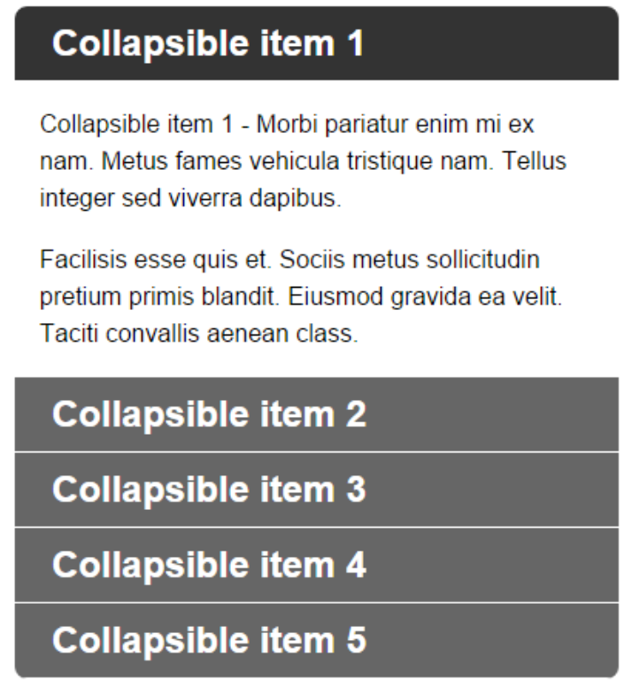

# Frontend Technical Assessment

The aim of this assessment is to give us an insight into your thought processes, general approach & problem solving skills.
It also gives us an understanding of your knowledge on the four primary frontend pillars:

- HTML
- CSS
- Javascript
- React.js

## Requirements

- Create a list of five collapsible items, each item will consist of the following components:
  - A title containing a toggle
  - A content block containing at least two paragraphs of text

_Please use this representation as a guide only_

## The Rules

- You must use React.JS framework.
- You may use any other libraries and preprocessors you would like, this is entirely up to you.
- It should be possible for more than one collapsible list to co-exist on the same page without affecting another.
- The first item in the list should be expanded by default, all other items should be collapsed.
- Toggles must collapse/expand the associated content block on click, no other content block should be affected.
- Hover & active states should be visually obvious.
- The first item in the list should have rounded top corners.
- The last item in the list should have rounded bottom corners, except when it's opened/active.
- Animated collapse/expand transitions are optional if time permits.
- It should have unit tests. For this you can use any testing framework you would like.

## What We Will Be Looking For
Through this assessment, we want to evaluate your approach in the following areas:

- **Code Quality:**
    - Utilize the DRY (Don't Repeat Yourself) principle.
    - Apply separation of concerns and adhere to good design patterns.
    - Implement unit tests.
- **Code Standards:**
    - Ensure consistency in coding style and patterns.
    - Follow industry best practices and coding conventions.
- **Code Robustness:**
    - Implement error handling mechanisms.
    - Ensure graceful failure of the app in exceptional scenarios.
- **App Performance:**
    - Optimize your code for improved performance.
- **UX Design Creativity:**
    - Present data in a user-friendly and intuitive manner.

## Submission
Please follow these instructions for submitting your assessment:

- To be completed on CodeSanbox (https://codesandbox.io/).
- Email the URL of your CodeSanbox solution back to me.

*Good luck and Happy Coding!*